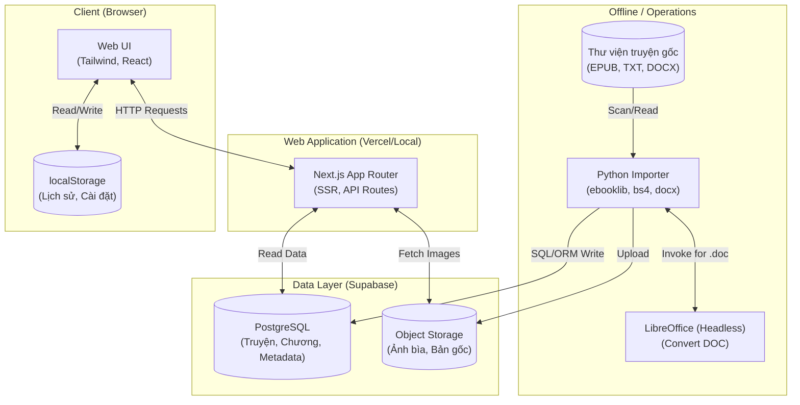
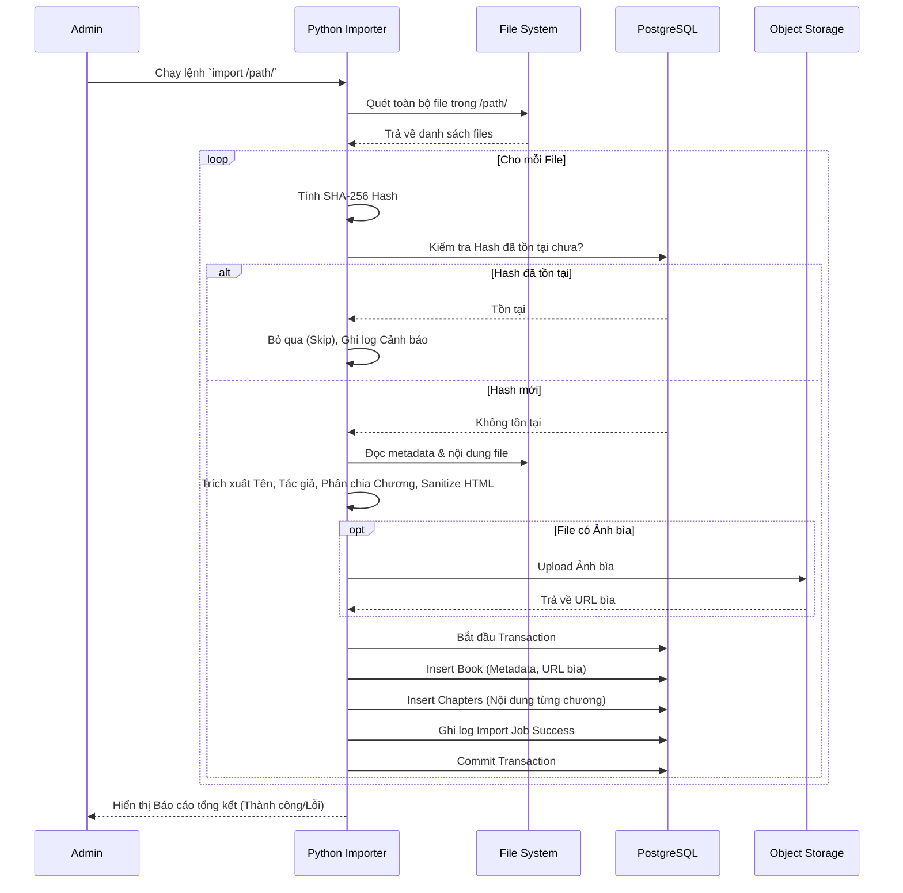
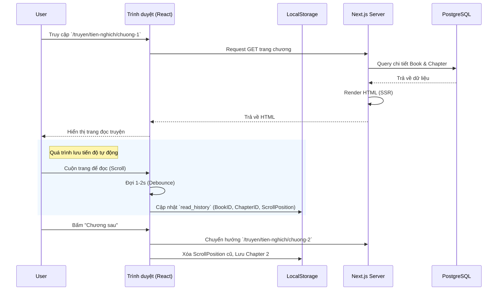
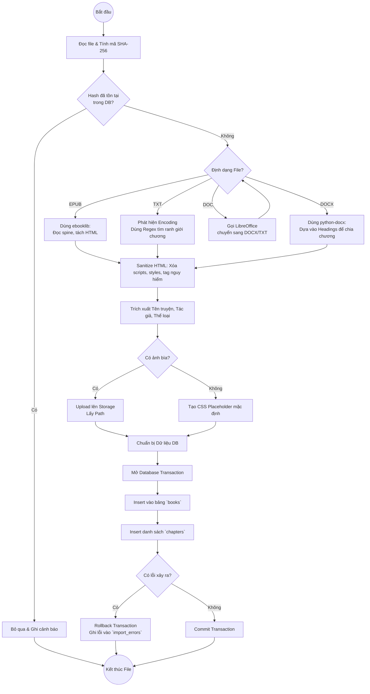

# Website Đọc Truyện - Design Document

Dựa trên tài liệu README ban đầu, dưới đây là tài liệu thiết kế kỹ thuật (Design Document) chi tiết bao gồm Yêu cầu hệ thống (Use Case), Thiết kế kiến trúc tổng thể (High-Level Design), Biểu đồ tuần tự (Sequence Diagram), và Biểu đồ luồng (Flow Diagram).

---

## 1. Yêu cầu Hệ thống (Requirements & Use Cases)

Hệ thống xoay quanh 2 tác nhân (Actor) chính: **Người đọc (Reader)** và **Hệ thống Nhập liệu (Importer/Admin)**. Do phiên bản MVP không có hệ thống User/Đăng nhập, tác nhân Reader hoàn toàn ẩn danh.

### 1.1. Tác nhân: Người đọc (Reader)
*   **UC1: Khám phá truyện (Browse):** Xem danh sách truyện ở trang chủ, truyện mới cập nhật, truyện đã hoàn thành, hoặc duyệt theo thể loại.
*   **UC2: Tìm kiếm (Search):** Tìm truyện theo tên, tên thay thế hoặc tên tác giả.
*   **UC3: Lọc & Sắp xếp (Filter & Sort):** Lọc danh sách truyện theo trạng thái (đang ra/hoàn thành), số lượng chương, thể loại và sắp xếp theo thời gian/tên.
*   **UC4: Xem thông tin truyện:** Xem chi tiết (Tác giả, trạng thái, mô tả) và danh sách các chương của một truyện.
*   **UC5: Đọc truyện (Read):** Xem nội dung chi tiết của một chương truyện.
*   **UC6: Tùy chỉnh giao diện đọc:** Thay đổi cỡ chữ, font chữ, độ rộng dòng, và màu nền (Sáng/Tối/Giấy/Xám).
*   **UC7: Lưu tiến độ đọc tự động:** Hệ thống tự động lưu lại chương đang đọc và vị trí cuộn trang hiện tại vào `localStorage`.
*   **UC8: Xem truyện đã đọc:** Xem lại danh sách "Truyện đã đọc gần đây" trên trang chủ dựa vào dữ liệu lưu tại LocalStorage.

### 1.2. Tác nhân: Hệ thống/Người vận hành (Importer)
*   **UC9: Quét thư viện (Scan):** Quét thư mục chứa các file truyện (EPUB, TXT, DOCX, DOC) để lấy thông tin và tạo báo cáo giả định (Dry-run).
*   **UC10: Nhập liệu hàng loạt (Import):** Đọc nội dung file, trích xuất metadata (Tên, tác giả, bìa) và chia nhỏ các chương truyện.
*   **UC11: Xử lý file DOC cũ:** Tự động gọi LibreOffice ẩn để chuyển đổi DOC sang định dạng chuẩn trước khi parse.
*   **UC12: Chống trùng lặp (Deduplicate):** Bỏ qua các file đã được import trước đó dựa trên mã Hash (SHA-256).
*   **UC13: Chuẩn hóa dữ liệu:** Tự động sanitize HTML để loại bỏ mã độc (script/style) trước khi lưu vào Database.

---

## 2. Thiết kế Kiến trúc Tổng thể (High-Level Design)

Hệ thống được chia làm hai luồng riêng biệt: Luồng Backend xử lý dữ liệu (Offline/Background) và Luồng Web phục vụ người dùng (Online).

**Mô tả Khối:**
1.  **Thư viện gốc:** Nơi lưu trữ file của người vận hành.
2.  **Python Importer:** Trái tim của quá trình số hóa dữ liệu. Xử lý logic bóc tách text, hash file và lưu dữ liệu chuẩn hóa vào DB.
3.  **Data Layer (Supabase):** PostgreSQL lưu metadata và nội dung text các chương. Storage lưu ảnh bìa.
4.  **Next.js:** Server render (SSR) nội dung để tối ưu SEO và gửi HTML hoàn chỉnh về Client.
5.  **Browser:** Hiển thị giao diện, thực hiện các logic lưu trạng thái đọc offline.

---

## 3. Biểu đồ Tuần tự (Sequence Diagram)

### 3.1. Luồng Import truyện (Python Importer)

### 3.2. Luồng Người dùng Đọc truyện & Lưu tiến độ

---

## 4. Biểu đồ Luồng (Flow Diagram)

### 4.1. Luồng xử lý một File của Importer

Biểu đồ này mô tả chi tiết logic bên trong của khối Python Importer khi xử lý một file đơn lẻ.

---

## 5. Hướng dẫn Triển khai (Deployment Steps)

Dự án được cấu trúc để phát triển và chạy thử trên môi trường Local trước khi đưa lên môi trường Cloud (Vercel + Supabase) với luồng CI/CD tự động thông qua GitHub.

### 5.1. Môi trường Local (Phát triển & Kiểm thử)
1. **Khởi tạo Database (Supabase Local):**
   - Cài đặt Docker và Supabase CLI.
   - Chạy lệnh `supabase start` để khởi chạy các container PostgreSQL và Storage cục bộ.
   - Chạy lệnh `supabase db push` (hoặc migrate) để tạo các bảng (books, chapters, categories...).
2. **Cấu hình biến môi trường:**
   - Tạo file `.env.local` trong thư mục `web/` với các thông tin kết nối Database của Supabase Local.
3. **Chạy Next.js Web App:**
   - Trong thư mục `web/`, chạy `npm install` và `npm run dev`.
   - Ứng dụng web sẽ chạy tại `http://localhost:3000`.
4. **Chạy Python Importer:**
   - Cài đặt các thư viện Python: `pip install -r requirements.txt`.
   - Chạy lệnh import để đưa truyện từ thư mục gốc vào Supabase Local: `python importer.py import /path/to/offline/library`.

### 5.2. Môi trường Production (Cloud qua GitHub & Vercel)
Quy trình này thiết lập luồng CI/CD: Bất cứ khi nào code mới được đẩy lên GitHub, Vercel sẽ tự động build và deploy giao diện web.

1. **Chuẩn bị Cloud Database (Supabase Cloud):**
   - Đăng ký/Đăng nhập Supabase (miễn phí) và tạo một Project mới.
   - Chạy migration để thiết lập cấu trúc database trên môi trường Cloud (tương tự như Local).
   - Lấy thông tin `Project URL` và `Anon Key` (hoặc `Service Role Key`) từ Dashboard Supabase.
2. **Quản lý Source Code (GitHub):**
   - Khởi tạo Git repository.
   - Đảm bảo file `.gitignore` đã chặn các file nhạy cảm: `node_modules`, `.env`, `.env.local`, các file `.db` local và **tuyệt đối không đưa thư mục chứa file truyện (EPUB, DOCX) lên GitHub**.
   - `git push` source code lên repository (Private/Public) trên tài khoản GitHub của bạn.
3. **Liên kết và Deploy tự động trên Vercel:**
   - Đăng nhập Vercel bằng tài khoản GitHub.
   - Chọn "Add New Project" -> Import repository GitHub vừa tạo.
   - Khung Framework Preset sẽ tự động nhận diện **Next.js**.
   - Tại phần **Environment Variables**, thêm các biến cấu hình trỏ về Database Supabase Cloud (VD: `NEXT_PUBLIC_SUPABASE_URL`, `NEXT_PUBLIC_SUPABASE_ANON_KEY`).
   - Nhấn **Deploy** và chờ Vercel cung cấp tên miền miễn phí (VD: `ten-du-an.vercel.app`).
4. **Cập nhật tự động (CI/CD Trigger):**
   - Vercel đã kết nối Webhook với GitHub. Kể từ lúc này, mỗi khi bạn gõ lệnh `git push` lên nhánh `main`, Vercel sẽ tự động kích hoạt tiến trình Build & Deploy bản cập nhật mới trong vòng 1-2 phút mà bạn không cần phải thao tác gì thêm trên server.
